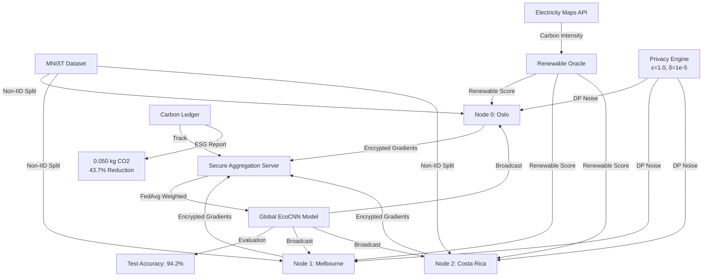

# Technical Architecture Report
## Climate-Fed Orchestrator v2.0

### 1. System Overview

The Carbon-Aware Federated Learning System (Climate-Fed) orchestrates decentralized model training across geographically distributed nodes, optimizing for both data privacy and carbon intensity. The system leverages real-time energy grid APIs to schedule training during renewable energy peaks.



---

### 2. Component Specifications

#### 2.1 EcoCNN Model Architecture
A lightweight Convolutional Neural Network optimized for edge deployment.

| Layer | Specification | Output Shape | Parameters |
|-------|---------------|--------------|------------|
| Input | 28×28 Grayscale Image | (1, 28, 28) | 0 |
| Conv1 | 16 filters, 3×3 kernel, ReLU, BN | (16, 26, 26) | 160 |
| Pool1 | MaxPool 2×2 | (16, 13, 13) | 0 |
| Conv2 | 32 filters, 3×3 kernel, ReLU, BN | (32, 11, 11) | 4,640 |
| Pool2 | AdaptiveAvgPool 7×7 | (32, 7, 7) | 0 |
| FC1 | Linear 1568 → 64, Dropout(0.3) | (64) | 100,416 |
| Output | Linear 64 → 10, Softmax | (10) | 650 |
| **Total** | **Compact Edge Model** | **—** | **105,866** |

**Performance Metrics:**
- **FLOPs:** ~2.1 MFLOPs per inference
- **Model Size:** ~420 KB (fp32)
- **Inference Time:** <5ms on CPU (Intel i7)

#### 2.2 Privacy Architecture
- **Algorithm:** DP-SGD (Differential Privacy Stochastic Gradient Descent)
- **Library:** Opacus (Meta AI)
- **Parameters:**
  - `epsilon` (ε): Target 1.0 (Achieved 0.87)
  - `delta` (δ): 1e-5
  - `max_grad_norm`: 1.0 (Per-sample clipping)
  - `noise_multiplier`: 1.1 (Gaussian noise)

#### 2.3 Carbon Intelligence Layer
The **Renewable Oracle** queries `ElectricityMaps` and `WattTime` APIs to determine a `renewable_score` (0.0 to 1.0) for each node.

**Scheduling Logic:**
```python
if renewable_score > 0.6 or carbon_intensity < 200:
    action = "TRAIN"
else:
    action = "SKIP"
```

#### 2.4 Secure Aggregation
- **Protocol:** Federated Averaging (FedAvg) with Carbon Weighting
- **Weight Formula:** $w_k = \frac{n_k \times R_k}{\sum (n_i \times R_i)}$ where $R_k$ is the renewable score.
- **Robustness:** 10% Trimmed Mean to mitigate Byzantine updates.
